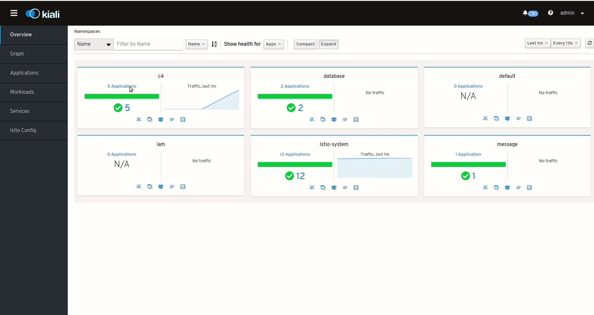

# c4-kustomize

Create all **namespaces**


```sh
$   microk8s.kubectl apply -k c4/base
```




## Helm

Helm install **mongo-order**

```sh
$   helm install stable/mongodb \
    --name="mongo-order" \
    --set="mongodbRootPassword=root-password" \
    --set="mongodbUsername=admin" \
    --set="mongodbPassword=admin" \
    --set="mongodbDatabase=c4-order-database" \
    --namespace database
```

Helm install **mongo-notify**

```sh
$   helm install stable/mongodb \
    --name="mongo-notify" \
    --set="mongodbRootPassword=root-password" \
    --set="mongodbUsername=admin" \
    --set="mongodbPassword=admin" \
    --set="mongodbDatabase=c4-notify-database" \
    --namespace database
```

Helm install **mongo-payment**

```sh
$   helm install stable/mongodb \
    --name="mongo-payment" \
    --set="mongodbRootPassword=root-password" \
    --set="mongodbUsername=admin" \
    --set="mongodbPassword=admin" \
    --set="mongodbDatabase=c4-payment-database" \
    --namespace database
```

Helm install **rabbitmq**

```sh
$   helm install stable/rabbitmq \
    --name rabbitmq \
    --set="rabbitmq.username=guest" \
    --set="rabbitmq.password=guest" \
    --set="persistence.size=1Gi" \
    --namespace message
```

Helm install **postgres**

```sh
$   helm install stable/postgresql \
    --name postgres \
    --set postgresqlPassword=pgpassword,postgresqlDatabase=c4-customer-database \
    --namespace database
```

## kustomize

Install **c4-customer**

```sh
$   kustomize build c4-customer/overlays/development/ | kubectl -n c4 apply -f -
```

Install **c4-order**

```sh
$   kustomize build c4-order/overlays/development/ | kubectl -n c4 apply -f -
```

Install **c4-payment**

```sh
$   kustomize build c4-payment/overlays/development/ | kubectl -n c4 apply -f -
```

Install **c4-ecommerce**

```sh
$   kustomize build c4-ecommerce/overlays/development/ | kubectl -n c4 apply -f -
```

Install **c4-notify**

```sh
$   kustomize build c4-notify/overlays/development/ | kubectl -n c4 apply -f -
```