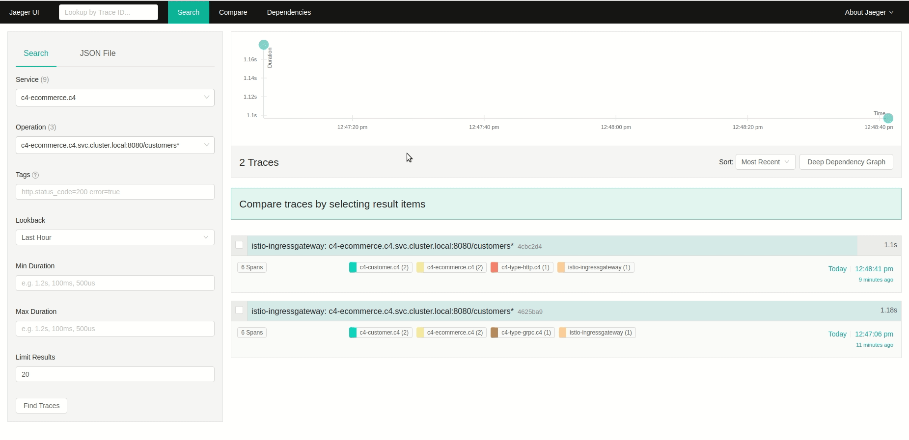

# c4-kustomize

[kustomize](https://kustomize.io/) `Kubernetes native configuration management`

## Flow


Create all **namespaces**


```sh
$   kubectl apply -k c4/base
```


## Distributed tracing [Jaeger](https://kustomize.io/)



## Helm

Helm install **mongo-order**

```sh
$   helm install mongo-order bitnami/mongodb \
    --set="auth.rootPassword=root-password" \
    --set="auth.username=admin" \
    --set="auth.password=admin" \
    --set="auth.database=c4-order-database" \
    --namespace database
```

Helm install **mongo-notify**

```sh
$   helm install mongo-notify bitnami/mongodb \
    --set="auth.rootPassword=root-password" \
    --set="auth.username=admin" \
    --set="auth.password=admin" \
    --set="auth.database=c4-notify-database" \
    --namespace database
```

Helm install **mongo-payment**

```sh
$   helm install mongo-payment bitnami/mongodb \
    --set="auth.rootPassword=root-password" \
    --set="auth.username=admin" \
    --set="auth.password=admin" \
    --set="auth.database=c4-payment-database" \
    --namespace database
```

Helm install **postgres**

```sh
$   helm install postgres bitnami/postgresql \
    --set postgresqlPassword=pgpassword,postgresqlDatabase=c4-customer-database \
    --namespace database
```

Helm install **kafka**

```sh
$   helm my-kafka incubator/kafka \
    --namespace message
```

## kustomize 

Install [c4-customer](https://github.com/FernandoCagale/c4-customer)

```sh
$   kustomize build c4-customer/overlays/development/ | kubectl -n c4 apply -f -
```

Install [c4-order](https://github.com/FernandoCagale/c4-order)

```sh
$   kustomize build c4-order/overlays/development/ | kubectl -n c4 apply -f -
```

Install [c4-payment](https://github.com/FernandoCagale/c4-payment)

```sh
$   kustomize build c4-payment/overlays/development/ | kubectl -n c4 apply -f -
```

Install [c4-ecommerce](https://github.com/FernandoCagale/c4-ecommerce)

```sh
$   kustomize build c4-ecommerce/overlays/development/ | kubectl -n c4 apply -f -
```

Install [c4-notify](https://github.com/FernandoCagale/c4-notify)

```sh
$   kustomize build c4-notify/overlays/development/ | kubectl -n c4 apply -f -
```

Install [c4-type](https://github.com/FernandoCagale/c4-type)

```sh
$   kustomize build c4-type/overlays/development/ | kubectl -n c4 apply -f -
```